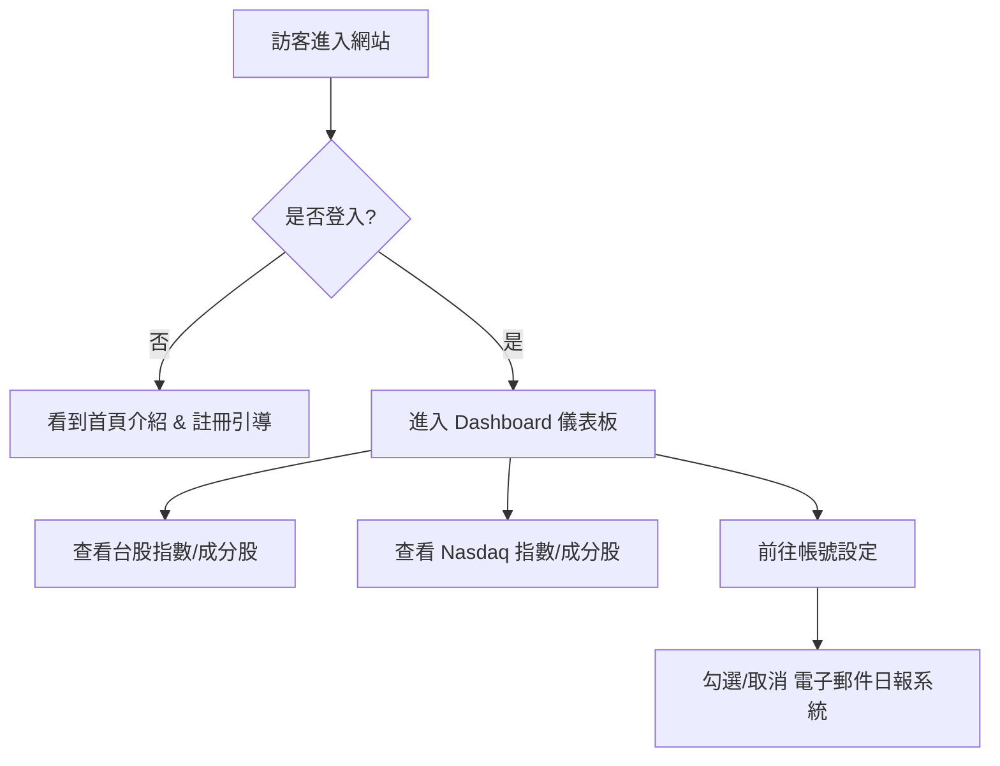

# 高 Beta 指數發佈平台：架構與設計提案

本提案旨在建立一個自動化、具備美感且提供給會員專屬價值的金融數據展示平台。

---

## 1. 視覺設計預覽 (UI Mockup)

網站採用 **深色主題 (Glass Dark Mode)** 以展現專業性。重點數據使用 **翡翠綠 (Emerald)** 與 **寶石藍 (Sapphire)** 作為強調色，確保圖表清晰且具備科技感。

---

## 2. 功能架構 (Functional Architecture)

系統分為四個核心模組：

### A. 使用者與會員系統 (Auth Module)
*   **訪客首頁**：介紹網站目的及高 Beta 指數的優勢（吸引註冊）。
*   **註冊/登入**：支援 Email/密碼登入，以及一鍵 Google 帳密登入。
*   **權限控制**：未登入者僅能看到首頁介紹，登入後才能查看圖表、成分股與權重。

### B. 數據展示中心 (Dashboard Module)
*   **市場概況**：一眼掌握台股與 Nasdaq 指數昨日的表現與回測圖位階。
*   **台股高 Beta 指數分頁**：
    *   **主圖表**：包含累積報酬率圖 (Cumulative Return)。
    *   **每日表格**：顯示最新指數值及當日報酬。
    *   **權重清單**：顯示 50 檔成分股名單與其最新權重。
*   **Nasdaq 高 Beta 指數分頁**：同上格式，方便切換。

### C. 個人化訂閱管理 (Subscription Module)
*   **通知設定**：會員可勾選「開啟每日收盤報信箱通知」。
*   **信箱管理**：設定接收通知的主要 Email。

### D. 後台自動化引擎 (Automation Engine - *隱形成分*)
*   **每日排程任務**：
    1.  自動透過 Python 下載股市最新資料。
    2.  重新計算指數與報酬曲線。
    3.  產出最新圖檔與數據 JSON。
    4.  **自動推送** 至 Supabase 資料庫與檔案空間。

---

## 3. 使用者流程 (User Experience Flow)

---

## 4. 自動化數據流 (Data Flow)

這部分解決您提到的「不透過我 (AI)」也能自動產出的關鍵：

1.  **Trigger (觸發)**：GitHub Actions 在台美股收盤後（每日對應時間）自動啟動。
2.  **Process (處理)**：執行我們寫好的 Python 後端腳本。
3.  **Sync (同步)**：
    *   **圖片**：上傳至 Supabase Storage。
    *   **數據**：更新至 Supabase Database。
4.  **Notify (通知)**：腳本最後檢查資料庫中「已訂閱」的會員，透過 Resend API 發送包含圖片與數據的郵件。

---

## 5. 建議技術棧 (Recommended Tech Stack)

| 類別 | 工具 | 理由 |
| :--- | :--- | :--- |
| **前端框架** | **Next.js 14** | 效能最穩定、SEO 佳、開發快速。 |
| **樣式設計** | **Vanilla CSS / Radix UI** | 打造高級感 UI 與流暢動畫。 |
| **會員與資料庫** | **Supabase** | 免費額度充足，包含 OAuth、PostgreSQL、Storage。 |
| **自動化排程** | **GitHub Actions** | 免費且無需自備伺服器。 |
| **郵件伺服器** | **Resend** | 目前最簡潔美觀的郵件發送服務（有每月 3000 封免費）。 |

---

> [!NOTE]
> 以上是針對您的初步功能規劃。若您認可此方向，我們可以開始準備帳號申請流程（由我引導您）或直接開始設計網站內容。您對哪個部分想更深入了解呢？
